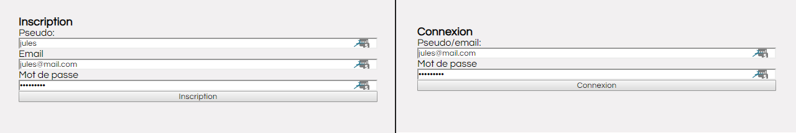
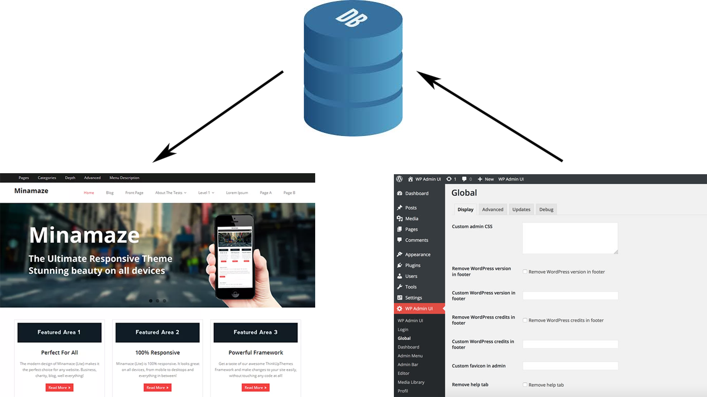

# 1.1 Introduction au SQL

 
 
## Pourquoi utiliser le **SQL** ?

>**SQL:** *Structured Query Language*

Interroger une ***base de données*** avec des ***requêtes***.

-----
 
 
## Termes à retenir

>**MCD:** *Modèle Conceptuel de Données*
**SGBD:** *Système de Gestion de Base de Données* (EN: *DBMS*)
**BDD:** *Base De Données* (EN: *DB*)

Liste de **SGBD**:
  - *PostGreSQL*
  - *Oracle*
  - *SQL Server*
  - *MySQL* (/ *MariaDB*)

-----
 
 
## Structure d'une BDD

Principe de **lignes** & **colonnes** -> **tableau** = `TABLE`
1 `BDD` = plusieurs `TABLE`s

> **Base de données:** `mon_forum` 
**Table:** `sujet`
>
>| titre       | description | cree_par | date_creation |
|-------------|-------------|----------|---------------|
| bienvenue ! | bonjour ... | admin    | 2018-09-01    |
| RDV demain  | rejoigne... | jules    | 2018-09-02    |
>
> 
**Table:** `utilisateur`
>
>| pseudo | email          | mot_de_passe | type   |
|---------|----------------|--------------|--------|
| admin   | admin@site.fr  | 65h1-e(v468  | admin  |
| jules   | jules@mail.com | azerty123    | membre |

-----
 
 
## Exemples d'utilisation dans le web

 
### Espace de connexion

>Formulaires ***HTML/CSS***
Récupération des données en ***PHP***
Requêtes ***SQL***

 
### Catalogue dynamique

>| <code class="prettyprint">catalogue.php</code> Requête SQL à résultats multiples | <code class="prettyprint">produit.php</code> Requête SQL à résultat unique |
|---|---|
Contenu ***dynamique*** (provenant d'une *base de données*)

 
### Front-Office & Back-Office

>| Front-Office (partie publique) | Base de Données | Back-Office (espace d'administration) |
|---|---|---|

-----
 
 
## Elaborer une requête

Savoir exprimer précisément ce que l'on veut pour écrire la requête SQL correspondante.
Les 4 requêtes possibles:
 - **C** requête d'insertion
 - **R** requête de sélection
 - **U** requête de modification
 - **D** requête de suppression

>1 requête = 1 action

Il existe des alternatives au SQL, les bases de données **NoSQL**:
 - bases **clef/valeur** (ex: ***Redis***)
 - bases **orientées colonnes** (ex: ***HBase, Cassandra***)
 - bases **orientées document** (ex: ***MongoDB***)
 - bases **orientées graphe** (ex: ***Neo4J***)

 
 

-----
**Précédent:** [Plan](?)
**Suivant:** [1.2 Préparation](?file=2_preparation.md)